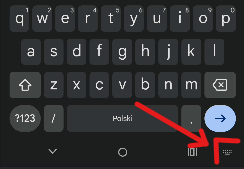
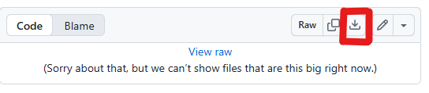
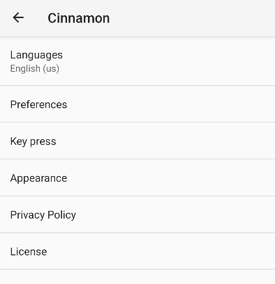
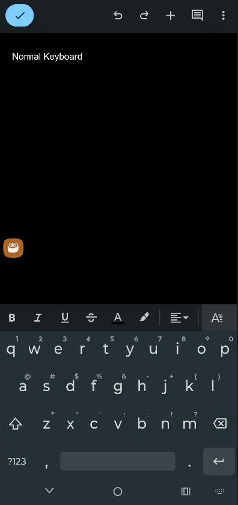
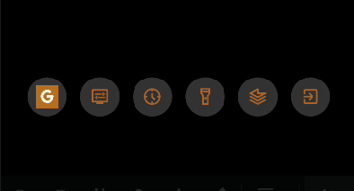
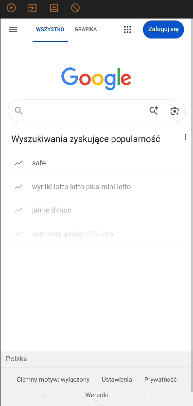

# Cinnamon - Simple-keyboard + built-in browser

  

## About

Cinnamon is a custom Android Input Method Editor (IME) based on AOSP LatinIME. It provides a fully functional keyboard together with overlay system that can display additional UI above the keyboard. 
Overlay controls can be found in:  
<i>overlay/CinnamonOverlayController.kt</i>  
In this version, you can find:
<ul><li>web browser (WebView)</li> 
<li>settings (wifi, data, bluetooth and other)</li> <li>flashlight controller</li>
<li>sensor data</li></ul>
  

App is compatible with <b>Android 8</b> or newer.

## Info

To use this keyboard, navigate to:   
System > Keyboard > On-screen keyboard
(and select Cinnamon)    

  
To switch to active keyboard:
  

 

## Downloads

Folder with APKs:  
https://github.com/T3xtuRED/cinnamon/blob/master/ReadyAPK/   
Latest APK:  
https://github.com/T3xtuRED/cinnamon/blob/master/ReadyAPK/Cinnamon_alfa-v0.0.1.apk

## Future updates
<i>###### NOTHING PLANNED RIGHT NOW #####</i>

## Bugs
Not fixed bugs:  
<ul><li>Keyboard blocks touch events outside the keyboard</li><li>Some buttons not working inside WebView</li></ul>

All issues:
https://github.com/T3xtuRED/cinnamon/issues
  
This app is still in development so it may contain bugs. If you find any, please report.
## Images
 
 
 
 
## Credits

Licensed under Apache License Version 2

This keyboard is based on AOSP LatinIME keyboard. You can get the original source code in https://android.googlesource.com/platform/packages/inputmethods/LatinIME/