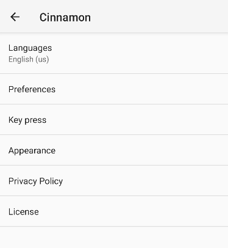
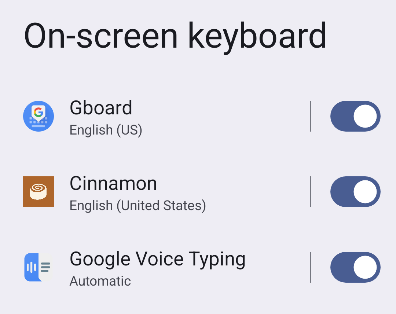

# Cinnamon - Simple-keyboard + built-in browser

<!--  -->
      
## About

Compatible with Android 8+. 

## Info

To use this keyboard, navigate to:  
System > Keyboard > On-screen keyboard
(and select Cinnamon)

## Downloads

Folder with APKs:  
https://github.com/T3xtuRED/cinnamon/blob/master/ReadyAPK/   
Latest APK:  
https://github.com/T3xtuRED/cinnamon/blob/master/ReadyAPK/Cinnamon_alfa-v0.0.1.apk

## Credits

Licensed under Apache License Version 2

This keyboard is based on AOSP LatinIME keyboard. You can get the original source code in https://android.googlesource.com/platform/packages/inputmethods/LatinIME/
